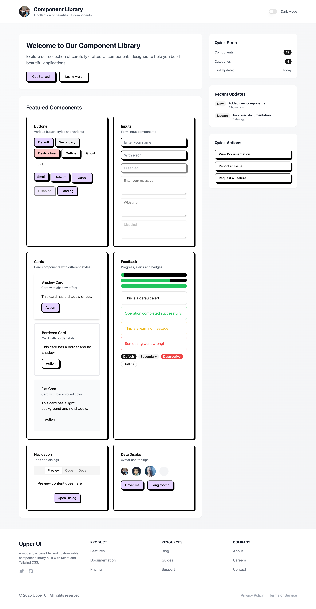

# Upper UI Component Library

A modern, accessible, and customizable component library built with React and Tailwind CSS.

## Features

- 🎨 Modern and clean design
- ♿️ Fully accessible components
- 🎯 Built with React and TypeScript
- 🎨 Styled with Tailwind CSS
- 📱 Responsive and mobile-friendly
- 🎨 Customizable theme support
- 📦 Easy to install and use

## Preview



The screenshot above shows the main interface of the component library, featuring:
- Modern header with dark mode toggle
- Hero section with call-to-action buttons
- Comprehensive component showcase
- Quick stats and recent updates
- Clean and professional footer

## Installation

```bash
git clone https://github.com/jiji262/upper-ui.git
cd upper-ui
npm install
```

## Quick Start

```tsx
import { Button } from './components/ui/data-entry/button';

function App() {
  return <Button>Click me</Button>;
}
```

## Components

### Component Styles

This library provides two distinct styles of components:

1. **Tailwind CSS Components** - Modern style components built with Tailwind CSS
2. **Upper UI Style Components** - Components that follow Upper UI guidelines

You can use either style or mix them in your project, depending on your design requirements.

### Tailwind Style Components

#### Typography

Provides components for rendering common text elements like titles, paragraphs, links, and general text with various styles.

```tsx
import { Title, Text, Paragraph, Link, Input } from './components/ui/general';

// Title (Levels 1-5)
<Title level={1}>Main Heading (Default H1)</Title>
<Title level={2} className="text-purple-600">Styled H2 Heading</Title>
<Title level={3}>Sub-heading H3</Title>
<Title level={4}>Smaller Heading H4</Title>
<Title level={5}>Even Smaller H5</Title>

// Paragraph
<Paragraph className="text-slate-700 dark:text-slate-300">
  This is a paragraph with custom styling. Lorem ipsum dolor sit amet, consectetur adipiscing elit, sed do eiusmod tempor incididunt ut labore et dolore magna aliqua.
</Paragraph>
<Paragraph>
  Standard paragraph. You can <Link href="#example" className="font-bold hover:text-destructive">include styled links</Link> too.
</Paragraph>

// Text (various styles and combinations)
<Text>Basic text element.</Text>
<Text strong>Strong (bold) text.</Text>
<Text italic>Italic text.</Text>
<Text underline>Underlined text.</Text>
<Text code>Inline code snippet: `const a = 10;`</Text>
<Text mark>Marked/highlighted text.</Text>
<Text type="secondary">Secondary color text.</Text>
<Text type="success" strong>Strong success text.</Text>
<Text type="warning" italic>Italic warning text.</Text>
<Text type="danger" size="lg">Large danger text.</Text>
<Text size="sm" className="text-blue-500">Small custom-colored text.</Text>
<Text disabled>This text is disabled.</Text>

// Using asChild prop (example with Text as a label)
<Text asChild strong>
  <label htmlFor="my-input">Label for Input:</label>
</Text>
{/* <Input id="my-input" placeholder="Input field" /> */}

// Link
<Link href="#example">Internal Link</Link>
<Link href="https://example.com" target="_blank">External Link (new tab)</Link>
```

#### Button

```tsx
import { Button } from './components/ui/data-entry/button';

// Basic usage
<Button>Default</Button>

// Variants
<Button variant="default">Default</Button>
<Button variant="secondary">Secondary</Button>
<Button variant="destructive">Destructive</Button>
<Button variant="outline">Outline</Button>
<Button variant="ghost">Ghost</Button>
<Button variant="link">Link</Button>

// Sizes
<Button size="sm">Small</Button>
<Button size="default">Default</Button>
<Button size="lg">Large</Button>

// States
<Button disabled>Disabled</Button>
```

#### Input

```tsx
import { Input } from './components/ui/data-entry/input';

// Basic usage
<Input placeholder="Enter text" />

// States
<Input disabled placeholder="Disabled" />
```

#### Textarea

```tsx
import { Textarea } from './components/ui/data-entry/textarea';

// Basic usage
<Textarea placeholder="Enter message" />

// States
<Textarea disabled placeholder="Disabled" />
```

#### Switch

```tsx
import { Switch } from './components/ui/data-entry/switch';

// Basic usage
<Switch checked={isChecked} onCheckedChange={setIsChecked} />
```

#### Form

A collection of components to build accessible and manageable forms, integrated with `react-hook-form` and `zod` for validation.

```tsx
import { 
  Form, 
  FormField, 
  FormItem, 
  FormLabel, 
  FormControl, 
  FormDescription, 
  FormMessage 
} from './components/ui/data-entry/form';
import { Input } from './components/ui/data-entry/input';
import { Button } from './components/ui/data-entry/button';
import { Textarea } from './components/ui/data-entry/textarea';
import { Checkbox } from './components/ui/data-entry/checkbox';
import { Switch } from './components/ui/data-entry/switch';
import { 
  Select, 
  SelectContent, 
  SelectItem, 
  SelectTrigger, 
  SelectValue 
} from "./components/ui/navigation/select"; // Note: Select is typically in navigation but used here
import { useForm } from 'react-hook-form';
import { z } from 'zod';
import { zodResolver } from '@hookform/resolvers/zod';

// 1. Define your form schema with Zod
const formSchema = z.object({
  username: z.string()
    .min(2, "Username must be at least 2 characters.")
    .max(50, "Username must be 50 characters or less."),
  email: z.string().email("Invalid email address."),
  bio: z.string().max(200).optional(),
  preferredFramework: z.enum(["react", "vue", "svelte", "angular"], { 
    required_error: "Please select a framework."
  }),
  agreesToTerms: z.boolean().refine(val => val === true, {
    message: "You must agree to the terms and conditions.",
  }),
  notifications: z.boolean().optional(),
});

type FormValues = z.infer<typeof formSchema>;

// 2. Create your form component
function MyEnhancedForm() {
  const form = useForm<FormValues>({
    resolver: zodResolver(formSchema),
    defaultValues: { // It's good practice to set default values
      username: "",
      email: "",
      bio: "",
      // preferredFramework: undefined, // Or a default valid enum value
      agreesToTerms: false,
      notifications: false,
    },
  });

  function onSubmit(data: FormValues) {
    console.log("Form Submitted!", data);
    // Handle your form submission logic (e.g., API call)
  }

  return (
    <Form {...form}> {/* Pass all form methods and state */} 
      <form onSubmit={form.handleSubmit(onSubmit)} className="space-y-6">
        <FormField
          control={form.control} // Connects to react-hook-form state
          name="username" // Must match a key in your Zod schema
          render={({ field }) => ( // `field` contains onChange, onBlur, value, ref
            <FormItem> {/* Provides context for labels and messages */} 
              <FormLabel>Username</FormLabel>
              <FormControl> {/* Renders the actual input component */} 
                <Input placeholder="shadcn" {...field} />
              </FormControl>
              <FormDescription>
                This is your public display name.
              </FormDescription>
              <FormMessage /> {/* Displays validation errors for this field */} 
            </FormItem>
          )}
        />
        
        <FormField
          control={form.control}
          name="email"
          render={({ field }) => (
            <FormItem>
              <FormLabel>Email</FormLabel>
              <FormControl>
                <Input type="email" placeholder="user@example.com" {...field} />
              </FormControl>
              <FormMessage />
            </FormItem>
          )}
        />

        <FormField
          control={form.control}
          name="bio"
          render={({ field }) => (
            <FormItem>
              <FormLabel>Bio (Optional)</FormLabel>
              <FormControl>
                <Textarea placeholder="Tell us about yourself..." {...field} />
              </FormControl>
              <FormMessage />
            </FormItem>
          )}
        />

        <FormField
          control={form.control}
          name="preferredFramework"
          render={({ field }) => (
            <FormItem>
              <FormLabel>Preferred UI Framework</FormLabel>
              <Select onValueChange={field.onChange} defaultValue={field.value}>
                <FormControl>
                  <SelectTrigger>
                    <SelectValue placeholder="Select a framework" />
                  </SelectTrigger>
                </FormControl>
                <SelectContent>
                  <SelectItem value="react">React</SelectItem>
                  <SelectItem value="vue">Vue.js</SelectItem>
                  <SelectItem value="svelte">Svelte</SelectItem>
                  <SelectItem value="angular">Angular</SelectItem>
                </SelectContent>
              </Select>
              <FormDescription>
                Choose your favorite framework.
              </FormDescription>
              <FormMessage />
            </FormItem>
          )}
        />

        <FormField
          control={form.control}
          name="notifications"
          render={({ field }) => (
            // Example of custom layout for a form item
            <FormItem className="flex flex-row items-center justify-between rounded-lg border p-4">
              <div className="space-y-0.5">
                <FormLabel className="text-base">Communication preferences</FormLabel>
                <FormDescription>
                  Receive email notifications.
                </FormDescription>
              </div>
              <FormControl>
                <Switch 
                  checked={field.value} 
                  onCheckedChange={field.onChange}
                />
              </FormControl>
            </FormItem>
          )}
        />

        <FormField
          control={form.control}
          name="agreesToTerms"
          render={({ field }) => (
            <FormItem className="flex flex-row items-start space-x-3 space-y-0">
              <FormControl>
                <Checkbox 
                  checked={field.value}
                  onCheckedChange={field.onChange}
                />
              </FormControl>
              <div className="space-y-1 leading-none">
                <FormLabel>Agree to terms and conditions</FormLabel>
                <FormDescription>
                  You agree to our <Link href="/terms">Terms of Service</Link>.
                </FormDescription>
                <FormMessage />
              </div>
            </FormItem>
          )}
        />

        <div className="flex space-x-2">
          <Button type="submit">Submit Form</Button>
          <Button type="button" variant="outline" onClick={() => form.reset()}>
            Reset
          </Button>
        </div>
      </form>
    </Form>
  );
}
```

#### Label

Used to label form elements. Integrates with Form components but can be used standalone.

```tsx
import { Label } from './components/ui/data-entry/label';
import { Input } from './components/ui/data-entry/input';

<div className="grid w-full max-w-sm items-center gap-1.5">
  <Label htmlFor="email-2">Email</Label>
  <Input type="email" id="email-2" placeholder="Email" />
</div>
```

#### Card

```tsx
import { Card, CardHeader, CardTitle, CardDescription, CardContent, CardFooter } from './components/ui/data-display/card';

// Basic usage
<Card>
  <CardHeader>
    <CardTitle>Card Title</CardTitle>
    <CardDescription>Card Description</CardDescription>
  </CardHeader>
  <CardContent>
    <p>Card content goes here</p>
  </CardContent>
  <CardFooter>
    <Button>Action</Button>
  </CardFooter>
</Card>

// With shadow
<Card className="shadow-md">
  {/* ... */}
</Card>

// With border
<Card className="border-2 border-gray-200">
  {/* ... */}
</Card>

// Flat style
<Card className="bg-gray-50">
  {/* ... */}
</Card>
```

#### Avatar

```tsx
import { Avatar } from './components/ui/data-display/avatar';

// With image
<Avatar src="https://example.com/avatar.jpg" />

// With initials
<Avatar>JD</Avatar>

// Sizes
<Avatar size="sm" src="..." />
<Avatar size="default" src="..." />
<Avatar size="lg" src="..." />
```

#### Badge

```tsx
import { Badge } from './components/ui/data-display/badge';

// Basic usage
<Badge>Default</Badge>

// Variants
<Badge variant="default">Default</Badge>
<Badge variant="secondary">Secondary</Badge>
<Badge variant="destructive">Destructive</Badge>
<Badge variant="outline">Outline</Badge>
```

#### Table

Components for displaying tabular data. Supports headers, footers, captions, and custom cell rendering.

```tsx
import {
  Table,
  TableHeader,
  TableBody,
  TableFooter,
  TableRow,
  TableHead,
  TableCell,
  TableCaption,
} from './components/ui/data-display/table';
import { Badge } from './components/ui/data-display/badge'; // For cell content
import { Button } from './components/ui/data-entry/button'; // For cell content

const invoices = [
  { id: "INV001", customer: "Alice Martin", status: "Paid", method: "Credit Card", amount: "$250.00" },
  { id: "INV002", customer: "Bob Johnson", status: "Pending", method: "PayPal", amount: "$150.00" },
  { id: "INV003", customer: "Charlie Brown", status: "Paid", method: "Bank Transfer", amount: "$350.75" },
  { id: "INV004", customer: "Diana Prince", status: "Unpaid", method: "Credit Card", amount: "$75.50" },
  // ...more invoices
];

function InvoiceTable() {
  const totalAmount = invoices.reduce((sum, inv) => sum + parseFloat(inv.amount.substring(1)), 0);

  return (
    <div className="max-h-96 overflow-y-auto rounded-md border"> {/* Example of a scrollable container */} 
      <Table>
        <TableCaption>A list of recent invoices. (Scroll for more if needed)</TableCaption>
        <TableHeader>
          <TableRow>
            <TableHead className="w-[100px]">Invoice ID</TableHead>
            <TableHead>Customer</TableHead>
            <TableHead>Status</TableHead>
            <TableHead>Payment Method</TableHead>
            <TableHead className="text-right">Amount</TableHead>
            <TableHead className="text-center">Actions</TableHead>
          </TableRow>
        </TableHeader>
        <TableBody>
          {invoices.map((invoice) => (
            <TableRow key={invoice.id} className={invoice.status === 'Paid' ? 'bg-green-50/50 dark:bg-green-900/20' : ''}>
              <TableCell className="font-medium">{invoice.id}</TableCell>
              <TableCell>{invoice.customer}</TableCell>
              <TableCell>
                <Badge 
                  variant={invoice.status === 'Paid' ? 'success' : invoice.status === 'Pending' ? 'warning' : 'destructive'}
                >
                  {invoice.status}
                </Badge>
              </TableCell>
              <TableCell>{invoice.method}</TableCell>
              <TableCell className="text-right">{invoice.amount}</TableCell>
              <TableCell className="text-center">
                <Button variant="outline" size="sm" onClick={() => alert(`Details for ${invoice.id}`)}>
                  View Details
                </Button>
              </TableCell>
            </TableRow>
          ))}
        </TableBody>
        <TableFooter>
          <TableRow>
            <TableCell colSpan={4} className="text-right font-semibold">Total</TableCell>
            <TableCell className="text-right font-bold">${totalAmount.toFixed(2)}</TableCell>
            <TableCell /> {/* Empty cell for actions column */} 
          </TableRow>
        </TableFooter>
      </Table>
    </div>
  );
}
```

#### Progress

```tsx
import { Progress } from './components/ui/feedback/progress';

// Basic usage
<Progress value={75} />
```

#### Alert

```tsx
import { Alert } from './components/ui/feedback/alert';

// Basic usage
<Alert>Default alert</Alert>

// Variants
<Alert variant="default">Default</Alert>
<Alert variant="success">Success</Alert>
<Alert variant="warning">Warning</Alert>
<Alert variant="destructive">Destructive</Alert>
```

#### Tooltip

```tsx
import { Tooltip, TooltipProvider } from './components/ui/feedback/tooltip';

// Basic usage
<TooltipProvider>
  <Tooltip content="Tooltip content">
    <Button>Hover me</Button>
  </Tooltip>
</TooltipProvider>
```

#### Skeleton

Used to display a placeholder preview of your content before the data gets loaded, improving perceived performance. Skeletons can be composed to match the structure of your UI.

```tsx
import { Skeleton } from './components/ui/feedback/skeleton';
import { Card, CardHeader, CardContent, CardFooter } from './components/ui/data-display'; // For card skeleton example

// Basic List Item Placeholder
<div className="flex items-center space-x-4 p-2 border rounded-md">
  <Skeleton className="h-12 w-12 rounded-full" />
  <div className="space-y-2">
    <Skeleton className="h-4 w-[250px]" />
    <Skeleton className="h-4 w-[200px]" />
  </div>
</div>

// Card Placeholder Example
<Card>
  <CardHeader>
    <Skeleton className="h-6 w-3/4 mb-2" />
    <Skeleton className="h-4 w-1/2" />
  </CardHeader>
  <CardContent className="space-y-3">
    <Skeleton className="h-4 w-full" />
    <Skeleton className="h-4 w-full" />
    <Skeleton className="h-4 w-5/6" />
  </CardContent>
  <CardFooter>
    <Skeleton className="h-10 w-24 rounded-lg" /> {/* Button-like skeleton */}
  </CardFooter>
</Card>

// Simple rectangular skeletons
<Skeleton className="h-8 w-full mt-4" />
<Skeleton className="h-10 w-32 rounded-lg mt-2" /> {/* Button-like */} 
```

#### Tabs

```tsx
import { Tabs, TabsList, TabsTrigger, TabsContent } from './components/ui/navigation/tabs';

// Basic usage
<Tabs defaultValue="account">
  <TabsList>
    <TabsTrigger value="account">Account</TabsTrigger>
    <TabsTrigger value="password">Password</TabsTrigger>
  </TabsList>
  <TabsContent value="account">
    <p>Account content</p>
  </TabsContent>
  <TabsContent value="password">
    <p>Password content</p>
  </TabsContent>
</Tabs>
```

#### DropdownMenu

Displays a menu to the user — such as a set of actions or functions — triggered by a button.

```tsx
import {
  DropdownMenu,
  DropdownMenuTrigger,
  DropdownMenuContent,
  DropdownMenuItem,
  DropdownMenuCheckboxItem,
  DropdownMenuRadioItem,
  DropdownMenuLabel,
  DropdownMenuSeparator,
  DropdownMenuShortcut,
  DropdownMenuGroup,
  DropdownMenuPortal,
  DropdownMenuSub,
  DropdownMenuSubContent,
  DropdownMenuSubTrigger,
  DropdownMenuRadioGroup,
} from './components/ui/navigation/dropdown-menu';
import { Button } from './components/ui/data-entry/button';
import { User, CreditCard, Settings, Keyboard, Users, UserPlus, Mail, MessageSquare, PlusCircle } from "lucide-react"; // Icons for Dropdown example

// Example with various features, similar to App.tsx demo
// const [showStatusBar, setShowStatusBar] = React.useState(true); // Example state for CheckboxItem
// const [radioPosition, setRadioPosition] = React.useState("bottom"); // Example state for RadioGroup

<DropdownMenu>
  <DropdownMenuTrigger asChild>
    <Button variant="outline">Open Menu</Button>
  </DropdownMenuTrigger>
  <DropdownMenuContent className="w-56" align="end"> {/* align="end" is a useful prop */}
    <DropdownMenuLabel>My Account</DropdownMenuLabel>
    <DropdownMenuSeparator />
    <DropdownMenuGroup>
      <DropdownMenuItem>
        <User className="mr-2 h-4 w-4" />
        <span>Profile</span>
        <DropdownMenuShortcut>⇧⌘P</DropdownMenuShortcut>
      </DropdownMenuItem>
      <DropdownMenuItem>
        <CreditCard className="mr-2 h-4 w-4" />
        <span>Billing</span>
        <DropdownMenuShortcut>⌘B</DropdownMenuShortcut>
      </DropdownMenuItem>
      <DropdownMenuItem>
        <Settings className="mr-2 h-4 w-4" />
        <span>Settings</span>
        <DropdownMenuShortcut>⌘S</DropdownMenuShortcut>
      </DropdownMenuItem>
      <DropdownMenuItem>
        <Keyboard className="mr-2 h-4 w-4" />
        <span>Keyboard shortcuts</span>
        <DropdownMenuShortcut>⌘K</DropdownMenuShortcut>
      </DropdownMenuItem>
    </DropdownMenuGroup>
    <DropdownMenuSeparator />
    <DropdownMenuGroup>
      <DropdownMenuItem>
        <Users className="mr-2 h-4 w-4" />
        <span>Team</span>
      </DropdownMenuItem>
      <DropdownMenuSub>
        <DropdownMenuSubTrigger>
          <UserPlus className="mr-2 h-4 w-4" />
          <span>Invite users</span>
        </DropdownMenuSubTrigger>
        <DropdownMenuPortal>
          <DropdownMenuSubContent>
            <DropdownMenuItem>
              <Mail className="mr-2 h-4 w-4" />
              <span>Email</span>
            </DropdownMenuItem>
            <DropdownMenuItem>
              <MessageSquare className="mr-2 h-4 w-4" />
              <span>Message</span>
            </DropdownMenuItem>
            <DropdownMenuSeparator />
            <DropdownMenuItem>
              <PlusCircle className="mr-2 h-4 w-4" />
              <span>More...</span>
            </DropdownMenuItem>
          </DropdownMenuSubContent>
        </DropdownMenuPortal>
      </DropdownMenuSub>
    </DropdownMenuGroup>
    <DropdownMenuSeparator />
    <DropdownMenuCheckboxItem
      // checked={showStatusBar} // Requires state
      // onCheckedChange={setShowStatusBar} // Requires state
    >
      Status Bar
    </DropdownMenuCheckboxItem>
    <DropdownMenuRadioGroup value={"bottom" /* radioPosition */} /* onValueChange={setRadioPosition} */>
      <DropdownMenuRadioItem value="top">Top</DropdownMenuRadioItem>
      <DropdownMenuRadioItem value="bottom">Bottom</DropdownMenuRadioItem>
      <DropdownMenuRadioItem value="right">Right</DropdownMenuRadioItem>
    </DropdownMenuRadioGroup>
    <DropdownMenuSeparator />
    <DropdownMenuItem disabled>
      <PlusCircle className="mr-2 h-4 w-4" /> {/* Example: Icon in disabled item */}
      <span>API (Disabled)</span>
    </DropdownMenuItem>
  </DropdownMenuContent>
</DropdownMenu>
```

#### Dialog

```tsx
import { Dialog, DialogTrigger, DialogContent, DialogHeader, DialogTitle, DialogDescription, DialogFooter } from './components/ui/feedback/dialog';

// Basic usage
<Dialog>
  <DialogTrigger asChild>
    <Button>Open Dialog</Button>
  </DialogTrigger>
  <DialogContent>
    <DialogHeader>
      <DialogTitle>Dialog Title</DialogTitle>
      <DialogDescription>
        Dialog description goes here.
      </DialogDescription>
    </DialogHeader>
    <div className="py-4">
      <p>Dialog content goes here.</p>
    </div>
    <DialogFooter>
      <Button variant="outline">Cancel</Button>
      <Button>Confirm</Button>
    </DialogFooter>
  </DialogContent>
</Dialog>
```

#### Footer

```tsx
import { Footer } from './components/ui/layout/footer';

// Basic usage
<Footer />

// With custom class
<Footer className="bg-gray-50" />
```

The Footer component provides a responsive, multi-column footer layout with:
- Company information and social links
- Product links
- Resource links
- Company links
- Copyright and legal links

Features:
- Responsive grid layout
- Social media icons
- Hover effects on links
- Copyright notice with current year
- Legal links section

### Upper UI Style Components

These components follow the Upper UI style system with black borders, box shadows, and purple accents, and can be imported directly.

#### Button

```tsx
import { Button } from './components/ui/general';

// Basic usage
<Button>Default</Button>

// Variants
<Button variant="outline">Default</Button>
<Button>Primary</Button>
<Button variant="outline" className="border-dashed">Dashed</Button>
<Button variant="ghost">Text</Button>
<Button variant="link">Link</Button>

// Sizes
<Button size="sm">Small</Button>
<Button>Default</Button>
<Button size="lg">Large</Button>

// States
<Button disabled>Disabled</Button>
<Button loading>Loading</Button>
<Button variant="destructive">Danger</Button>
```

#### Input

```tsx
import { Input } from './components/ui/data-entry/input';

// Basic usage
<Input placeholder="Basic usage" />

// Sizes
<Input size="large" placeholder="Large size" />
<Input placeholder="Default size" />
<Input size="small" placeholder="Small size" />

// Status
<Input error={true} placeholder="Error" />
<Input error={true} placeholder="Warning" />

// With addon elements
<div className="flex items-center">
  <span className="mr-2">http://</span>
  <Input placeholder="Website" />
  <span className="ml-2">.com</span>
</div>

// Disabled
<Input placeholder="Disabled" disabled />
```

#### Checkbox

```tsx
import { Checkbox } from './components/ui/data-entry/checkbox';

// Basic usage
<Checkbox label="Checkbox" />

// Controlled checkbox
<Checkbox 
  label="Controlled Checkbox"
  checked={checked} 
  onChange={(e) => setChecked(e.target.checked)}
/>

// Disabled
<Checkbox label="Disabled" disabled />

// Indeterminate state
<Checkbox label="Indeterminate" indeterminate />
```

#### Select

```tsx
import SelectAnt from './components/ui/data-entry/Select/Select';

// Basic usage
<SelectAnt
  options={[
    { label: 'Option 1', value: '1' },
    { label: 'Option 2', value: '2' },
    { label: 'Option 3', value: '3' },
  ]}
  placeholder="Please select"
  value={selectValue}
  onChange={(value) => setSelectValue(value)}
/>

// Disabled
<SelectAnt
  disabled
  options={[
    { label: 'Option 1', value: '1' },
    { label: 'Option 2', value: '2' },
  ]}
  placeholder="Disabled"
/>

// Multiple selection
<SelectAnt
  mode="multiple"
  options={[
    { label: 'Option 1', value: '1' },
    { label: 'Option 2', value: '2' },
    { label: 'Option 3', value: '3' },
  ]}
  placeholder="Select multiple"
/>
```

#### Textarea

```tsx
import TextareaAnt from './components/ui/data-entry/Textarea/Textarea';

// Basic usage
<TextareaAnt placeholder="Basic usage" />

// Show count
<TextareaAnt showCount maxLength={100} placeholder="With character count" />

// Status
<TextareaAnt status="error" placeholder="Error" />
```

#### Icon

```tsx
import Icon from './components/ui/general/Icon/Icon';

// Basic usage
<Icon name="UploadOutlined" />
<Icon name="LeftOutlined" />
<Icon name="RightOutlined" />

// With custom styling
<Icon name="UploadOutlined" style={{ fontSize: '24px', color: 'purple' }} />
```

For more components and detailed documentation, please refer to the code examples in the `/src/components/ui` directory.

## Customization

### Theme

You can customize the theme by extending the Tailwind configuration:

```js
// tailwind.config.js
module.exports = {
  theme: {
    extend: {
      colors: {
        primary: {
          DEFAULT: '#3B82F6',
          dark: '#2563EB',
        },
      },
    },
  },
}
```

### Styling

All components can be styled using Tailwind CSS classes:

```tsx
<Button className="bg-custom-color hover:bg-custom-color-dark">
  Custom Button
</Button>
```

## Contributing

We welcome contributions! Please see our [Contributing Guide](CONTRIBUTING.md) for details.

## License

MIT © [jiji262]